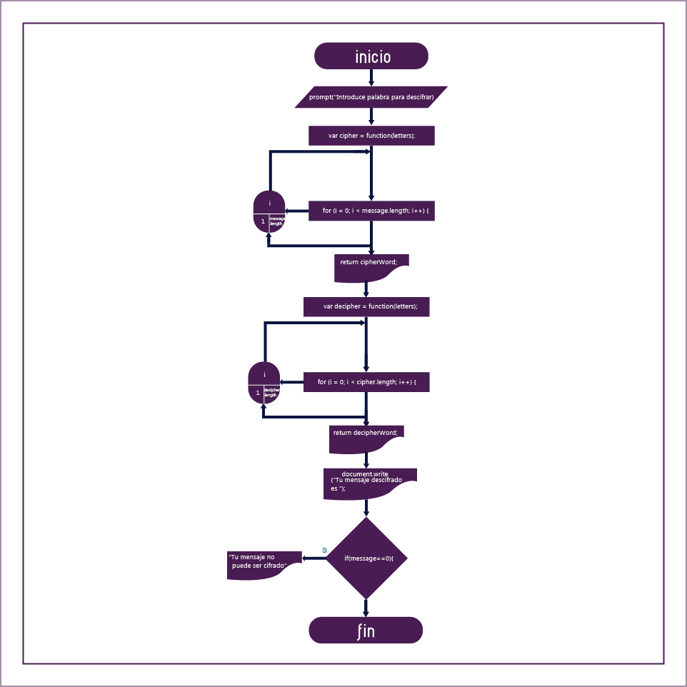

# Cifrado Cesar
Crea una web que pida, por medio de un prompt(), una frase al usuario y devuelva
el mismo mensaje encriptado según el algoritmo de Cifrado César con el
parámetro de desplazamiento de 33 espacios hacia la derecha,

## Pseudoocódigo
1. Pedir al usuario mediante un prompt(), que introduzca una frase para cifrar.
2. Declarar una función que nos retorne como resultado el mensaje cifrado.
3. Recorrer la longitud del mensaje ingresado mediante un ciclo for.
4. Con el método charCodeAt, se obtendrá el código ascii de la letras del mensaje.
5. Imprimir en la consola el resultado cifrado.
6. Declarar una segunda función que nos retorne como resultado el mensaje
   descifrado.
7. Recorrer la longitud del mensaje cifrado mediante un ciclo for.
8. Con el método String.fromCharCode, se hará la conversión del codigo ascii a
   letras.
9. Mediante un document.write, imprimir el mensaje descifrado.
10. Con una condición determinar que si el usuario no ingresa mensaje alguno,
    el mensaje no podrá ser descifrado.
11. Mostrar una alerta que le notifique al usuario lo anterior.

### Diagrama de flujo
A continuación se incluye diagrama de flujo:

